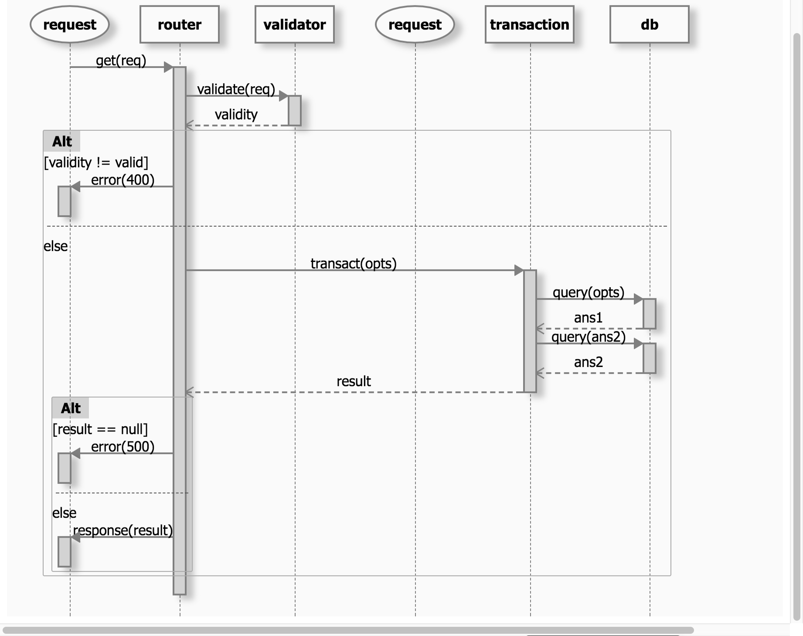

# Dukaan Backend

Amazon = Apni Dukaan
Coding Blocks = Sabki Dukaan

## Getting Started

### Create Database
Create DB, User

```shell
$ sudo -u postgress createuser dukaandar
$ sudo -u postgres createdb dukaandb
$ sudo -u postgres psql
```
Give user a password, grant db privileges
```postgres-psql
psql=# alter user dukaandar with encrypted password 'taalaachaabi';
psql=# grant all privileges on database dukaandb to dukaandar ;
```

Save these values to config.js

### Documentation

Detailed source documentation in the [docs](docs/src) folder

Detailed API docs in the [api docs](docs/api) folder

To Generate docs -
```shell
npm run docs
```

## Directory Strucure

### Top Level Structure

```
.
├── README.md
├── config.js           # Configs (eg, DB)
├── dist                # Compiled JS code
├── docs                # Autogenerated docs (good quality)
├── node_modules        
├── package-lock.json
├── package.json
├── src                 # Typescript source
├── tsconfig.json       # Typescript build config
└── tslint.json
```

### Basic Abstraction
Our usual request handling cycle would be like this -



Using transactions is optional (not used everywhere)

```javascript
route.get('/', (req, res, next) => {
    validateGetProductsReq(req)
        .then((findOpts) => getAllProducts(findOpts)
            .then((products) => res.status(200).json(products))
            .catch((dbErr) => res.status(500).json(dbErr)))
        .catch((invalidErr) => res.status(400).json(invalidErr))
})
```

### Source Code Structure

```
src
├── controllers                 # All controllers
│   └── data                    # Data controllers
│       └── products.ts         # Product-related controllers
│
│
├── db                          # Everything related to db
│   ├── index.ts                # Sequelize setup and sync file (import all models into this)
│   └── models                  # Models go here 
│       ├── Product.ts          # Product model (for eg.)
│       └── Tax.ts              # Tax model (for eg.)
│
│
├── routes                      # All Routes
│   └── api                     # API routes
│       ├── index.ts            # Import all API routes here
│       └── products.ts         # API route for /api/products
│
│
├── server.ts                   # Server creation file, exports express app
├── start.ts                    # Express app imported and started here
│
└── validators                  # All validators here
    └── api                     # API-related validators here
        └── products.ts         # Product request validators here

```
